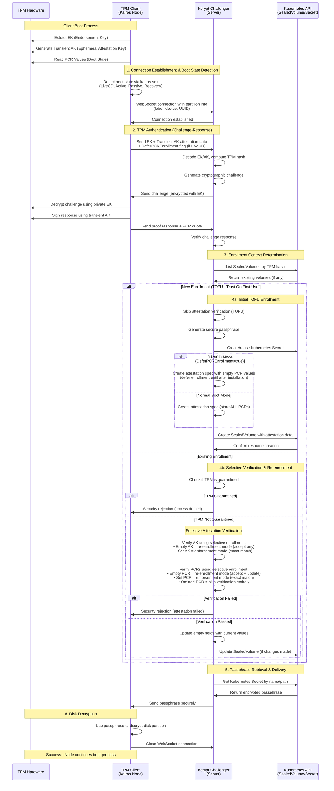

<h1 align="center">
  <br>
     <br>
    Kcrypt challenger
<br>
</h1>

<h3 align="center">Kcrypt TPM challenger</h3>
<p align="center">
  <a href="https://opensource.org/licenses/">
    
  </a>
  <a href="https://github.com/kairos-io/kcrypt-challenger/issues"></a>
  <a href="https://kairos.io/docs/" target=_blank> </a>
  
  
  <a href="https://github.com/kairos-io/kcrypt-challenger/actions/workflows/e2e-tests.yml?query=branch%3Amain"> </a>
</p>


With Kairos you can build immutable, bootable Kubernetes and OS images for your edge devices as easily as writing a Dockerfile. Optional P2P mesh with distributed ledger automates node bootstrapping and coordination. Updating nodes is as easy as CI/CD: push a new image to your container registry and let secure, risk-free A/B atomic upgrades do the rest.


<table>
<tr>
<th align="center">

<p>
<small>
Documentation
</small>
</p>
</th>
<th align="center">

<p>
<small>
Contribute
</small>
</p>
</th>
</tr>
<tr>
<td>

 📚 [Getting started with Kairos](https://kairos.io/docs/getting-started) <br> :bulb: [Examples](https://kairos.io/docs/examples) <br> :movie_camera: [Video](https://kairos.io/docs/media/) <br> :open_hands:[Engage with the Community](https://kairos.io/community/)

</td>
<td>

🙌[ CONTRIBUTING.md ]( https://github.com/kairos-io/kairos/blob/master/CONTRIBUTING.md ) <br> :raising_hand: [ GOVERNANCE ]( https://github.com/kairos-io/kairos/blob/master/GOVERNANCE.md ) <br>:construction_worker:[Code of conduct](https://github.com/kairos-io/kairos/blob/master/CODE_OF_CONDUCT.md)

</td>
</tr>
</table>

| :exclamation: | This is experimental! |
|-|:-|

This is the Kairos kcrypt-challenger Kubernetes Native Extension.

## Usage

See the documentation in our website: https://kairos.io/docs/advanced/partition_encryption/.

### TPM NV Memory Cleanup

⚠️ **DANGER**: This command removes encryption passphrases from TPM memory!
⚠️ **If you delete the wrong index, your encrypted disk may become UNBOOTABLE!**

During development and testing, the kcrypt-challenger may store passphrases in TPM non-volatile (NV) memory. These passphrases persist across reboots and can accumulate over time, taking up space in the TPM.

To clean up TPM NV memory used by the challenger:

```bash
# Clean up the default NV index (respects config or defaults to 0x1500000)
kcrypt-discovery-challenger cleanup

# Clean up a specific NV index
kcrypt-discovery-challenger cleanup --nv-index=0x1500001

# Clean up with specific TPM device
kcrypt-discovery-challenger cleanup --tpm-device=/dev/tpmrm0
```

**Safety Features:**
- By default, the command shows warnings and prompts for confirmation
- You must type "yes" to proceed with deletion
- Use `--i-know-what-i-am-doing` flag to skip the prompt (not recommended)

**Note**: This command uses native Go TPM libraries and requires appropriate permissions to access the TPM device.

## Installation

To install, use helm:

```
# Adds the kairos repo to helm
$ helm repo add kairos https://kairos-io.github.io/helm-charts
"kairos" has been added to your repositories
$ helm repo update
Hang tight while we grab the latest from your chart repositories...
...Successfully got an update from the "kairos" chart repository
Update Complete. ⎈Happy Helming!⎈

# Install the CRD chart
$ helm install kairos-crd kairos/kairos-crds
NAME: kairos-crd
LAST DEPLOYED: Tue Sep  6 20:35:34 2022
NAMESPACE: default
STATUS: deployed
REVISION: 1
TEST SUITE: None

# Installs challenger
$ helm install kairos-challenger kairos/kcrypt-challenger
```

## Building Kairos Images

The Makefile provides several targets for building Kairos ISO images with the kcrypt-challenger integrated.

### Building Standard ISO

Build a standard Kairos ISO with the challenger:

```bash
make kairos-iso
```

### Building ISO with Custom Binaries

Build an ISO using custom versions of immucore or kairos-agent from their repositories:

```bash
make kairos-iso IMMUCORE_REF=main KAIROS_AGENT_REF=main NO_CACHE=true
```

**Parameters:**
- `IMMUCORE_REF`: Git branch, tag, or commit hash for immucore (e.g., `main`, `v1.0.0`)
- `KAIROS_AGENT_REF`: Git branch, tag, or commit hash for kairos-agent (e.g., `main`, `v1.0.0`)
- `NO_CACHE`: Set to `true` to build without using Docker cache (useful for fresh builds)

### Building UKI (Unified Kernel Image) ISO

Build a UKI ISO with secure boot signing support:

```bash
make kairos-iso-uki
```

**Prerequisites:**
- Secure boot keys must be generated first using `make genkeys`
- Keys are stored in `$(HOME)/tmp/keys` by default (configurable via `KEYS_DIR`)

**Generate keys:**
```bash
make genkeys KEYS_ORG="Your Organization Name"
```

The UKI ISO includes secure boot signing and TPM PCR signing capabilities.

## Remote Attestation Flow

The kcrypt-challenger implements a secure TPM-based remote attestation flow for disk encryption key management. The system includes special handling for LiveCD mode to support installation scenarios where PCR values differ between the installation media and the installed system.

The following diagram illustrates the complete attestation process:



### Transient Attestation Key (AK) Approach

The kcrypt-challenger now uses a **transient AK approach** that eliminates the need for persistent AK storage:

- **No Persistent Storage**: AKs are created fresh for each attestation request
- **EK-Only Enrollment**: Only the Endorsement Key (EK) is enrolled and stored on the server
- **Ephemeral AKs**: Each boot generates a new transient AK for attestation
- **Reduced TPM Usage**: No persistent TPM resources are consumed for AK storage
- **Simplified Management**: No need to manage AK lifecycle or cleanup

### Flow Explanation

1. **Boot State Detection & Connection**: Client detects boot state (LiveCD vs normal boot) and establishes WebSocket connection with partition metadata
2. **TPM Authentication**: Cryptographic challenge-response proves client controls the TPM hardware
3. **Enrollment Determination**: Server checks if this TPM is already enrolled
4. **Security Verification**:
   - **TOFU**: New TPMs are automatically enrolled (Trust On First Use)
   - **LiveCD Mode**: PCR enrollment is deferred (empty values) for later enrollment after installation
   - **Selective Enrollment**: Existing TPMs undergo flexible verification based on field states
5. **Passphrase Delivery**: Encrypted disk passphrase is securely delivered to authenticated client

### LiveCD Mode PCR Deferral

During system installation from LiveCD media, PCR values may differ from the final installed system (especially when using `--source` flag to install a different image). To handle this scenario:

**During Installation (LiveCD Mode)**:
- Client detects LiveCD boot state using `kairos-sdk/state.NewRuntime()`
- Sends `DeferPCREnrollment: true` flag to server
- Server creates SealedVolume with:
  - ✅ TPM hash enrolled (computed from EK)
  - ✅ EK public key enrolled
  - ⏸️ PCR values set to empty strings (deferred for later enrollment)
- Passphrase is delivered successfully for installation to proceed

**After Installation (First Normal Boot)**:
- Client detects normal boot state (Active/Passive, not LiveCD)
- Sends `DeferPCREnrollment: false`
- Server sees PCRs are empty (re-enrollment mode)
- Server updates empty PCRs with actual current values
- PCRs are now enrolled and enforced going forward

**Security Measure**:
- Once PCRs are enrolled (non-empty), the `DeferPCREnrollment` flag is ignored
- Prevents attackers from bypassing PCR verification by faking LiveCD mode
- System must boot correctly with matching PCRs to decrypt

**Boot State Detection**:
The client uses `kairos-sdk/state.NewRuntime()` which detects LiveCD boot by examining:
- `/proc/cmdline` for: `live:LABEL`, `live:CDLABEL`, or `netboot`
- EFI variables for UKI boot scenarios
- This is the same detection used by `kairos-agent state get boot` command

### Selective Enrollment States

| Field State | Verification | Updates | Use Case |
|-------------|-------------|---------|----------|
| **Empty** (`""`) | ✅ Accept any value | ✅ Update with current | Re-learn after TPM/firmware changes |
| **Set** (`"abc123"`) | ✅ Enforce exact match | ❌ No updates | Strict security enforcement |
| **Omitted** (deleted) | ❌ Skip entirely | ❌ Never re-enrolled | Ignore volatile PCRs (e.g., PCR 11) |

## Selective Enrollment Mode for TPM Attestation

The kcrypt-challenger implements a sophisticated "selective enrollment mode" that solves operational challenges in real-world TPM-based disk encryption deployments. This feature provides flexible attestation management while maintaining strong security guarantees.

### Key Features

- Full selective enrollment with three field states (empty, set, omitted)
- Trust On First Use (TOFU) automatic enrollment
- Secret reuse after SealedVolume recreation
- PCR re-enrollment for kernel upgrades
- PCR omission for volatile boot stages
- Early quarantine checking with fail-fast behavior

### How Selective Enrollment Works

The system supports two distinct enrollment behaviors:

#### **Initial TOFU Enrollment** (No SealedVolume exists)
- **Store ALL PCRs** provided by the client (don't omit any)
- Create complete attestation baseline from first contact
- Enables full security verification for subsequent attestations

#### **Selective Re-enrollment** (SealedVolume exists with specific fields)
- **Empty values** (`""`) = Accept any value, update the stored value (re-enrollment mode)
- **Set values** (`"abc123..."`) = Enforce exact match (enforcement mode)
- **Omitted fields** = Skip verification entirely (ignored mode)

**Selective Enrollment Behavior Summary:**

| Field State | Verification | Updates | Use Case |
|-------------|-------------|---------|----------|
| **Empty** (`""`) | ✅ Accept any value | ✅ Update with current | Re-learn after TPM/firmware changes |
| **Set** (`"abc123"`) | ✅ Enforce exact match | ❌ No updates | Strict security enforcement |
| **Omitted** (deleted) | ❌ Skip entirely | ❌ Never re-enrolled | Ignore volatile PCRs (e.g., PCR 11) |

### SealedVolume API Examples

#### **Attestation Configuration Options Summary**

| Configuration | EK Behavior | PCR Behavior | Use Case |
|--------------|-------------|--------------|----------|
| **No `spec.attestation`** | Learn all | Learn all PCRs | Pure TOFU / Static passphrase setup |
| **`attestation: {}`** | Learn EK, enforce | Skip all PCRs | EK-only verification (no boot state) |
| **`attestation: { ekPublicKey: "", pcrValues: { pcrs: { "0": "", "7": "" } } }`** | Learn EK, enforce | Learn & enforce PCR 0, 7 only | Selective PCR tracking |
| **`attestation: { ekPublicKey: "abc...", pcrValues: { pcrs: { "0": "def..." } } }`** | Enforce exact match | Enforce exact PCR 0 | Full enforcement mode |

**Key Points:**
- `nil` (omitted field) = Learn everything via TOFU
- Empty object `{}` or empty string `""` = Learn on first use, then enforce
- Set value `"abc123..."` = Strict enforcement (exact match required)
- Omitted from map = Skip entirely (never verify, never store)

#### **Example 1: Initial TOFU Enrollment**
When no SealedVolume exists, the server automatically creates one with ALL received PCRs:

```yaml
# Server creates this automatically during TOFU enrollment
apiVersion: keyserver.kairos.io/v1alpha1
kind: SealedVolume
spec:
  TPMHash: "computed-from-client"
  attestation:
    ekPublicKey: "learned-ek"    # Learned from client
    akPublicKey: "learned-ak"    # Learned from client
    pcrValues:
      pcrs:
        "0": "abc123..."         # All received PCRs stored
        "7": "def456..."
        "11": "ghi789..."        # Including PCR 11 if provided
```

#### **Example 2: Selective Re-enrollment Control**
Operators can control which fields allow re-enrollment:

```yaml
# Operator-controlled selective enforcement
apiVersion: keyserver.kairos.io/v1alpha1
kind: SealedVolume
spec:
  TPMHash: "required-tpm-hash"   # MUST be set for client matching
  attestation:
    ekPublicKey: ""              # Empty = re-enrollment mode
    akPublicKey: "fixed-ak"      # Set = enforce this value
    pcrValues:
      pcrs:
        "0": ""                  # Empty = re-enrollment mode
        "7": "fixed-value"       # Set = enforce this value
        # "11": omitted          # Omitted = skip entirely
```

### Use Cases Solved

1. **Pure TOFU**: No SealedVolume exists → System learns ALL attestation data from first contact
2. **Static Passphrase Tests**: Create Secret + SealedVolume with TPM hash, let TOFU handle attestation data
3. **Production Manual Setup**: Operators set known passphrases + TPM hashes, system learns remaining security data
4. **Firmware Upgrades**: Set PCR 0 to empty to re-learn after BIOS updates
5. **TPM Replacement**: Set AK/EK fields to empty to re-learn after hardware changes
6. **Flexible Boot Stages**: Omit PCR 11 entirely so users can decrypt during boot AND after full system startup
7. **Kernel Updates**: Omit PCR 11 to avoid quarantine on routine Kairos upgrades

### Practical Operator Workflows

#### **Scenario 1: Reusing Existing Passphrases After SealedVolume Recreation**

**Problem**: An operator needs to recreate a SealedVolume (e.g., after accidental deletion or configuration changes) but wants to keep using the existing passphrase to avoid re-encrypting the disk.

**Solution**: The system automatically reuses existing Kubernetes secrets when available:

```bash
# 1. Operator accidentally deletes SealedVolume
kubectl delete sealedvolume my-encrypted-volume

# 2. Original secret still exists in cluster
kubectl get secret my-encrypted-volume-encrypted-data
# NAME                                  TYPE     DATA   AGE
# my-encrypted-volume-encrypted-data    Opaque   1      5d

# 3. When TPM client reconnects, system detects existing secret
# and reuses the passphrase instead of generating a new one
```

**Behavior**: The system will:
- Detect the existing secret with the same name
- Log: "Secret already exists, reusing existing secret"
- Use the existing passphrase for decryption
- Recreate the SealedVolume with current TPM attestation data
- Maintain continuity without requiring disk re-encryption

#### **Scenario 2: Deliberately Skipping PCRs After Initial Enrollment**

**Problem**: An operator initially enrolls with PCRs 0, 7, and 11, but later realizes PCR 11 changes frequently due to kernel updates and wants to ignore it permanently.

**Solution**: Remove the PCR from the SealedVolume specification:

```bash
# 1. Initial enrollment created SealedVolume with:
# pcrValues:
#   pcrs:
#     "0": "abc123..."
#     "7": "def456..."
#     "11": "ghi789..."

# 2. Operator edits SealedVolume to remove PCR 11 entirely
kubectl edit sealedvolume my-encrypted-volume
# Remove the "11": "ghi789..." line completely

# 3. Result - omitted PCR 11:
# pcrValues:
#   pcrs:
#     "0": "abc123..."
#     "7": "def456..."
#     # PCR 11 omitted = ignored entirely
```

**Behavior**: The system will:
- Skip PCR 11 verification entirely (no enforcement)
- Never re-enroll PCR 11 in future attestations
- Log: "PCR verification successful using selective enrollment" (without mentioning PCR 11)
- Continue enforcing PCRs 0 and 7 normally

#### **Scenario 3: Manual PCR Selection During Initial Setup**

**Problem**: An operator knows certain PCRs will be unstable and wants to exclude them from the beginning.

**Solution**: Create the initial SealedVolume manually with only desired PCRs:

```yaml
# Create SealedVolume with selective PCR enforcement from the start
apiVersion: keyserver.kairos.io/v1alpha1
kind: SealedVolume
metadata:
  name: selective-pcr-volume
spec:
  TPMHash: "known-tpm-hash"
  partitions:
    - label: "encrypted-data"
      secret:
        name: "my-passphrase"
        path: "passphrase"
  attestation:
    ekPublicKey: ""          # Re-enrollment mode (will learn EK on first boot)
    pcrValues:
      pcrs:
        "0": ""              # Re-enrollment mode (will learn)
        "7": ""              # Re-enrollment mode (will learn)
        # "11": omitted      # Skip PCR 11 entirely
```

**Behavior**: The system will:
- Learn and enforce the EK on first attestation
- Learn and enforce PCRs 0 and 7 on first attestation
- Completely ignore PCR 11 (never verify, never store)
- Allow flexible boot stages without PCR 11 interference

**Alternative - Omit ALL PCRs**:
```yaml
# Learn EK only, skip ALL PCR verification
spec:
  attestation: {}            # Empty object = learn EK, ignore all PCRs
```

**Behavior**: The system will:
- Learn and enforce the EK (TPM identity)
- Accept any PCR values without verification
- Never store or track PCR values
- Useful when boot state verification is not needed

#### **Scenario 4: Kernel Upgrade - Temporary PCR Re-enrollment**

**Problem**: An operator is performing a kernel upgrade and knows PCR 11 will change, but wants to continue enforcing it after the upgrade (unlike permanent omission).

**Solution**: Set the PCR value to empty string to trigger re-enrollment mode:

```bash
# 1. Before kernel upgrade - PCR 11 is currently enforced
kubectl get sealedvolume my-volume -o jsonpath='{.spec.attestation.pcrValues.pcrs.11}'
# Output: "abc123def456..."  (current PCR 11 value)

# 2. Set PCR 11 to empty string to allow re-enrollment
kubectl patch sealedvolume my-volume --type='merge' \
  -p='{"spec":{"attestation":{"pcrValues":{"pcrs":{"11":""}}}}}'

# 3. Perform kernel upgrade and reboot

# 4. After reboot, TPM client reconnects and system learns new PCR 11 value
# Log will show: "Updated PCR value during selective enrollment, pcr: 11"

# 5. Verify new PCR 11 value is now enforced
kubectl get sealedvolume my-volume -o jsonpath='{.spec.attestation.pcrValues.pcrs.11}'
# Output: "new789xyz012..."  (new PCR 11 value after kernel upgrade)
```

**Behavior**: The system will:
- Accept any PCR 11 value on next attestation (re-enrollment mode)
- Update the stored PCR 11 with the new post-upgrade value
- Resume strict PCR 11 enforcement with the new value
- Log: "Updated PCR value during selective enrollment"

**Key Difference from Scenario 2:**
- **Scenario 2 (Omit PCR)**: PCR 11 permanently ignored, never verified again
- **Scenario 4 (Empty PCR)**: PCR 11 temporarily re-enrolled, then enforced with new value

### Security Architecture

- **TPM Hash is mandatory** - prevents multiple clients from matching the same SealedVolume
- **EK verification remains strict** - only AK and PCRs support selective enrollment modes
- **Early quarantine checking** - quarantined TPMs are rejected immediately after authentication
- **Comprehensive logging** - all enrollment events are logged for audit trails
- **Challenge-response authentication** - prevents TPM impersonation attacks

### Quick Reference for Documentation

**Common Operations:**

```bash
# Skip a PCR permanently (never verify again)
kubectl edit sealedvolume my-volume
# Remove the PCR line entirely from pcrValues.pcrs

# Temporarily allow PCR re-enrollment (e.g., before kernel upgrade)
kubectl patch sealedvolume my-volume --type='merge' -p='{"spec":{"attestation":{"pcrValues":{"pcrs":{"11":""}}}}}'

# Re-learn a PCR after hardware change (e.g., PCR 0 after BIOS update)
kubectl patch sealedvolume my-volume --type='merge' -p='{"spec":{"attestation":{"pcrValues":{"pcrs":{"0":""}}}}}'

# Re-learn EK after TPM replacement (transient AK approach)
kubectl patch sealedvolume my-volume --type='merge' -p='{"spec":{"attestation":{"ekPublicKey":""}}}'

# Check current PCR enforcement status
kubectl get sealedvolume my-volume -o jsonpath='{.spec.attestation.pcrValues.pcrs}' | jq .
```

**Log Messages to Expect:**

- `"Secret already exists, reusing existing secret"` - Passphrase reuse scenario
- `"Updated PCR value during selective enrollment"` - Re-enrollment mode active
- `"PCR verification successful using selective enrollment"` - Omitted PCRs ignored
- `"PCR enforcement mode verification passed"` - Strict enforcement active

## ✅ E2E Testing Coverage for Selective Enrollment

### Status: ✅ COMPLETED
Comprehensive E2E test suite has been implemented covering all selective enrollment scenarios. The test suite is optimized for efficiency using VM reuse patterns to minimize execution time while maintaining thorough coverage.

### ✅ Implemented E2E Test Scenarios

#### **Comprehensive Remote Attestation Workflow**
- [x] **Complete E2E Test Suite**: All remote attestation scenarios consolidated into a single comprehensive test (`remote-complete-workflow`)
  - TOFU enrollment, quarantine management, PCR management, AK management
  - Secret reuse, error handling, multi-partition support
  - Performance testing, security verification, and operational workflows

#### **9. Logging & Observability**
- [x] **Audit Trail Verification**: Security events logging validation (integrated across all tests)
- [x] **Log Message Accuracy**: Expected log messages verification (integrated across all tests)
- [x] **Metrics Collection**: Performance monitoring during tests (integrated across all tests)

#### **10. Compatibility Testing**
- [x] **TPM 2.0 Compatibility**: Software TPM emulation with TPM 2.0 (all tests use `swtpm`)
- [x] **Kernel Variations**: PCR behavior testing across different scenarios (`remote-large-pcr`)
- [x] **Hardware Variations**: TPM emulation covering different chip behaviors (via `swtpm`)

### Test Implementation Details

The comprehensive test suite includes:

- **18 Test Labels**: Covering all scenarios from basic to advanced
- **3 Test Files**: Organized by complexity and VM reuse optimization
- **VM Reuse Pattern**: Reduces test time from ~40 minutes to ~20 minutes
- **Real TPM Emulation**: Uses `swtpm` for realistic TPM behavior
- **GitHub Workflow Integration**: All tests run in CI/CD pipeline

See [`tests/README.md`](tests/README.md) for detailed test documentation and usage instructions.

### Test Environment Requirements

- **Real TPM Hardware**: Software TPM simulators may not catch hardware-specific issues
- **Kernel Build Pipeline**: Ability to test actual kernel upgrades and PCR changes
- **Multi-Node Clusters**: Test distributed scenarios and namespace isolation
- **Network Partitioning**: Test resilience under network failures
- **Performance Monitoring**: Metrics collection for scalability validation

### Success Criteria

All E2E tests must pass consistently across:
- Different hardware configurations (various TPM chips)
- Multiple kernel versions (to test PCR 11 variability)
- Various cluster configurations (single-node, multi-node)
- Different load conditions (single client, concurrent clients)

Completing this E2E test suite will provide confidence that the selective enrollment system works reliably in production environments.
